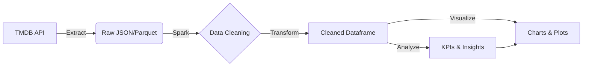

# TMDB Movie Data Analysis Pipeline

A scalable, container-ready data engineering pipeline built with Apache Spark (PySpark) to analyze The Movie Database (TMDB) data. This project extracts movie details, cleanses the dataset, calculates key performance indicators (KPIs), and generates visualizations.

## 🚀 Key Features

*   **Automated Extraction**: Fetches data dynamically from TMDB API.
*   **Spark Processing**: Utilizes PySpark for distributed data processing and cleaning.
*   **KPI Analysis**:
    *   Best & Worst Performing Movies (Revenue/Profit).
    *   Franchise vs. Standalone Analysis.
    *   Director Success Metrics.
    *   Search Query Analysis.
*   **Visualization**: Generates insight charts using Matplotlib/Pandas integration.

## 🔄 ETL Flow



## 🛠 Prerequisites

Ensure you have the following installed on your system:

*   **Python 3.11.7**: [Download Python](https://www.python.org/downloads/)
*   **Java 17**: Required for Apache Spark. (Top-level install or JAVA_HOME configured)

## ⚡ Quick Start

We provide an automated PowerShell script to handle environment setup and execution.

### 1. Configure Environment
Ensure a `.env` file exists in the project root with your TMDB API key:
```env
api_key=YOUR_API_KEY_HERE
```

### 2. Run the Pipeline
Open your terminal (PowerShell) and execute:

```powershell
.\run_pipeline.ps1
```

> [!TIP]
> **Execution Policy Error?**
> If you see an error like "run_pipeline.ps1 cannot be loaded because running scripts is disabled", run this instead:
> ```powershell
> powershell -ExecutionPolicy Bypass -File .\run_pipeline.ps1
> ```

> [!NOTE]
> This script will automatically:
> - Create a virtual environment (`venv`) if one doesn't exist.
> - Install all required dependencies from `requirements.txt`.
> - Execute the Spark ETL job.

## 📂 Project Structure

```
BySpark/
├── analysis/           # KPI calculation logic
├── cleaning/           # Data preprocessing and schema validation
├── extraction/         # API fetching modules
├── visualization/      # Charting and plotting scripts
├── data/               # Output directory for Parquet/CSV files
├── main.py             # Entry point for the ETL pipeline
├── run_pipeline.ps1    # Execution automation script
└── requirements.txt    # Python dependencies
```

## 📝 Manual Execution

If you prefer to run the project manually:

1.  **Create/Activate Virtual Environment**:
    ```bash
    python -m venv venv
    .\venv\Scripts\activate
    ```

2.  **Install Dependencies**:
    ```bash
    pip install -r requirements.txt
    ```

3.  **Run Application**:
    ```bash
    python main.py
    ```

## 📊 Outputs

Upon successful execution, processed data is saved to the `data/` directory:
*   `data/raw_parquet`: Raw ingested data in Parquet format.
*   `data/raw_csv`: (Optional) Raw data in CSV format.

Visualizations are displayed or saved to the `plots/` directory (if configured).
