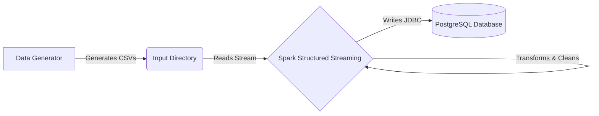

# Project Overview: Real-Time Data Ingestion Pipeline

## Introduction
This project simulates an e_commerce platform's real-time data ingestion pipeline. It generates synthetic user event data (views, purchases), processes it using Apache Spark Structured Streaming, and persists the results into a PostgreSQL database for analysis.

## System Architecture

The system consists of three main components:
1.  **Data Generator**: A Python script that produces CSV files simulating real-time events.
2.  **Stream Processor**: A Spark Structured Streaming application that monitors the input directory, processes new files, and cleans the data.
3.  **Storage Layer**: A PostgreSQL database that stores the processed events.

### Data Flow Diagram

## Tools & Technologies
- **Python**: For data generation script.
- **Apache Spark**: For real-time stream processing.
- **PostgreSQL**: For relational data storage.
